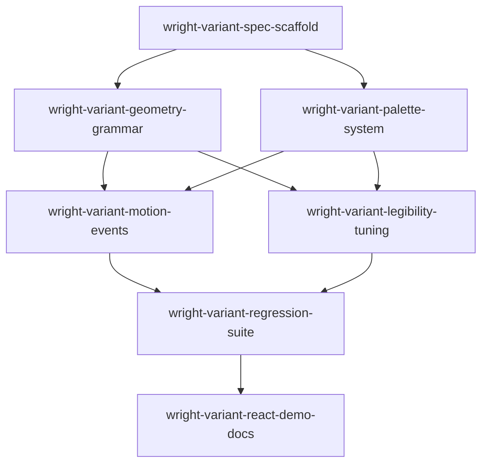

```yaml
initiative: frank-lloyd-wright-variant
created: 2026-09-20
last-updated: 2026-09-20
```

# Frank Lloyd Wright Variant Initiative

## Goal
Deliver a deterministic, seed-stable Frank Lloyd Wright inspired identicon variant that follows the existing prismicon variant contract end to end: architectural composition grammar, constrained material palette behavior, event-driven animation semantics, small-size legibility, and full regression coverage without changing existing variant identities or public API behavior.

## Decisions
- 1. all companion updates
- 2. We will only ship once fully completed
- 3. Whatever you think gives the highest chance of success
- 4. Match existing variants
- 5. Whatever is best, again we will not ship till fully complete

## Research
Skills consulted: modern-javascript-patterns, vercel-react-best-practices

- Variant contract and registration are defined in src/variants/registry.js (defineVariant/createVariantRegistry) and wired by src/variants/index.js through BUILT_IN_VARIANTS and resolveVariant.
- Static/mounted render flow and event state transitions live in src/core.js, with STATES fixed to idle/working/waiting/done/error/thinking/sending/receiving/sleeping and an internal settling state used by animate.
- Deterministic seed/hash primitives are centralized in src/variants/seed.js (cyrb53, mulberry32) and existing variants freeze draw order by spec-version comments in src/variants/polyhedron.js, src/variants/ncube.js, and src/variants/orbit.js.
- Built-in family patterns show architecture for new work: derive/prepare/geometry/pose/animate/paint/flash split, size-aware prepare downgrades for tiny sizes, and flash-driven hue/lighten/shake behavior (polyhedron/ncube/orbit).
- Palette behavior in current built-ins uses shared hue indices from polyhedron PALETTE and per-variant shade calculations in paint functions; this is the integration point for a constrained Wright material palette strategy.
- Public extension path is createPrismicon in src/authoring.js with validateVariant in src/variants/validate.js enforcing determinism and SSR-safety probes.
- Golden regression infrastructure is established via scripts/generate-golden.mjs, test/helpers/golden.js family mapping, and family-specific fixtures (golden-v1, golden-ncube-v1, golden-orbit-v1) verified by scripts/check-variants.mjs.
- Existing closest architectural references are orbit for flat grid-like 2D composition and ncube/polyhedron for mature event animation semantics and frozen derivation discipline.

## Features
### wright-variant-spec-scaffold
- Summary: Add the Wright variant descriptor scaffold, registration, and frozen derivation-spec framing so the new family is selectable through existing APIs without behavior changes elsewhere.
- Brief: Establish where and how the new variant plugs into the real repository abstractions and public variant selection flow.
- Requires: none
- Recommended after: none
- Wave: 1
- Size: M
- Independence: The package gains a new selectable built-in variant ID that cleanly participates in static/mounted rendering contracts even before full visual complexity is added.

### wright-variant-geometry-grammar
- Summary: Implement deterministic Wright composition families and hierarchical geometry grammar (primary mass, horizontal planes, grid/decorative layers, accents) from seed-derived parameters.
- Brief: Translate Prairie/art-glass/textile/usonian design language into constrained procedural geometry rather than random rectangles.
- Requires: wright-variant-spec-scaffold
- Recommended after: none
- Wave: 2
- Size: L
- Independence: Produces stable, recognizable Wright-family structure for all seeds using existing rendering hooks, enabling standalone visual review and iteration.

### wright-variant-palette-system
- Summary: Introduce a constrained architectural palette-family mapper with strict accent-budget and contrast rules integrated into the existing color-generation path.
- Brief: Deliver Wright-inspired material color behavior (earth/stone/wood/olive/charcoal plus restrained red accents) without creating a disconnected color subsystem.
- Requires: wright-variant-spec-scaffold
- Recommended after: wright-variant-geometry-grammar
- Wave: 2
- Size: M
- Independence: Adds deterministic, reusable color semantics to the Wright variant while preserving API and allowing static regression capture independent of animation work.

### wright-variant-motion-events
- Summary: Map prismicon runtime states and transient events to restrained architecture-consistent animation motifs (illumination paths, panel pulses, structural settle/reconstruct).
- Brief: Preserve geometric identity while making state changes legible through Wright-like motion language rather than generic transforms.
- Requires: wright-variant-geometry-grammar, wright-variant-palette-system
- Recommended after: none
- Wave: 3
- Size: M
- Independence: Completes behavior parity with existing animated variants through state-driven motion and flash semantics without requiring test-fixture expansion first.

### wright-variant-legibility-tuning
- Summary: Add size-aware geometry reduction and stroke/ornament thresholds so icons remain recognizable at small avatar sizes while retaining architectural character at larger sizes.
- Brief: Implement graceful detail reduction using existing prepare/geometry thresholds instead of a new complex LOD framework.
- Requires: wright-variant-geometry-grammar, wright-variant-palette-system
- Recommended after: wright-variant-motion-events
- Wave: 3
- Size: M
- Independence: Provides production-readability guarantees across target icon sizes and can be validated visually and by bounds checks regardless of final golden updates.

### wright-variant-regression-suite
- Summary: Extend deterministic/golden/performance test coverage and fixture wiring for the Wright family, including representative seed sets and event-frame stability checks.
- Brief: Lock behavior against regressions and ensure existing variants remain byte-identical and unaffected.
- Requires: wright-variant-motion-events, wright-variant-legibility-tuning
- Recommended after: none
- Wave: 4
- Size: M
- Independence: Establishes objective quality gates for the new family and hard protection for existing families before release.

### wright-variant-react-demo-docs
- Summary: Complete companion updates and usage/documentation/demo coverage for variant discovery, architecture notes, and any React-facing selection implications.
- Brief: Ensure all companion-facing updates are shipped with the implementation and aligned with existing variant authoring/selection conventions.
- Requires: wright-variant-regression-suite
- Recommended after: none
- Wave: 5
- Size: S
- Independence: Delivers publish-ready narrative and demo evidence after technical behavior is frozen, without reopening core derivation or animation logic.

## Recommended order
Wave 1 focuses on the safest integration seam first so later work cannot drift from the repository's established variant contract.
Wave 2 builds deterministic visual identity in two separable concerns (geometry grammar and palette) to maximize reviewability and reduce coupled churn.
Wave 3 adds runtime behavior and size legibility only after static identity is stable, preserving deterministic debugging.
Wave 4 hardens with regression fixtures, and Wave 5 closes with final companion-facing updates, matching the requirement to ship only when fully complete.



## Risks
- Geometry complexity explosion may create accidental visual noise instead of architectural hierarchy; mitigate with bounded module counts, explicit layer quotas, and seed-parameter clamps.
- Thin-line and small-pane motifs can collapse at small sizes; mitigate with minimum stroke widths, minimum pane area thresholds, and detail suppression in prepare.
- Palette families can drift into low-contrast or over-accented outputs; mitigate with deterministic contrast checks and hard accent-area budgets.
- Event animations may obscure identity or create chaotic motion; mitigate by restricting transforms to low-amplitude structural offsets/illuminations and enforcing settling-to-rest behavior.
- Golden fixture churn risk is high during early tuning; mitigate by freezing derivation draw order/spec only after grammar and legibility are validated, then capturing final fixtures once.
- Integration risk to existing variants/public API; mitigate with explicit unchanged-output checks for polyhedron/ncube/orbit and export-contract assertions in existing check:variants flow.

## Out of scope
- Recreating any specific Frank Lloyd Wright building elevation, window composition, textile block, logo, or historical ornament drawing.
- Introducing new public API surfaces or option keys unless unavoidable for parity with existing variant patterns.
- Building a generalized multi-variant LOD framework beyond targeted Wright variant prepare/geometry thresholds.
- Non-deterministic visual features dependent on runtime randomness, time-of-day, or external data.

## Definition of done
The initiative is done when all member features are complete and merged, the Wright variant is selectable through existing APIs, deterministic static and mounted outputs are frozen by updated golden fixtures, event-state animations are restrained and architecture-consistent, small-size legibility is verified, companion documentation/demo updates are complete, and all existing variant outputs remain unchanged except intentional new Wright-family artifacts.
