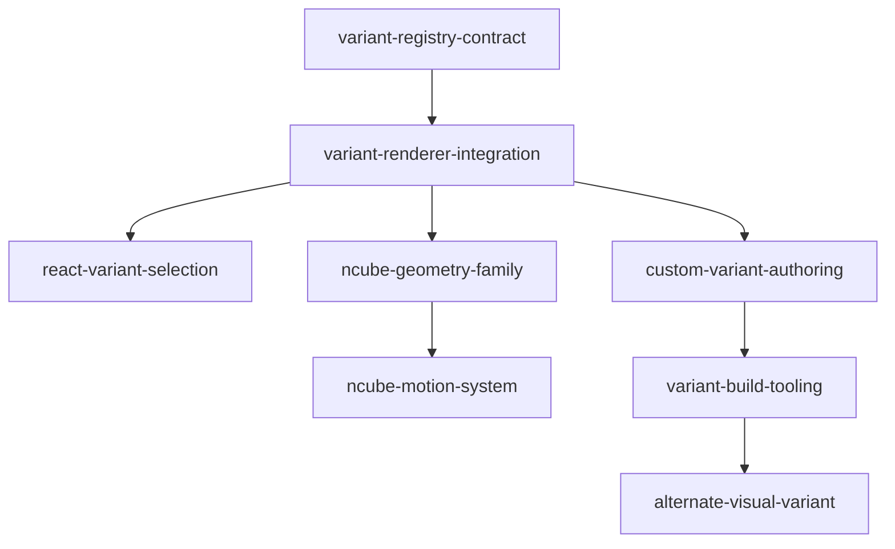

```yaml
initiative: scalable-icon-variants
created: 2026-09-08
last-updated: 2026-09-08
```

# Scalable Icon Variants

## Goal

Let package consumers select a deterministic visual variant per icon through both the core JavaScript and React APIs, add their own variants, and use an extensible authoring and management system whose first rich family projects animated n-cubes from dimension 3 through the highest practical supported dimension onto a 3D plane.

## Decisions

1. What does “namitations” mean here: animations, naming conventions, or something else?

   animations

2. Should the first release include several n-cube variants, and if so, which dimensions (for example 2-cube, 3-cube, 4-cube)?

   3 should be the smallest and we should go as high as we can

3. Should consumers select one package-wide default variant, choose variants per icon, or support both?

   variants per icon

4. Must variant selection work through every current API, including core JavaScript and React?

   Yes

5. What is explicitly out of scope for this initiative, such as custom consumer-defined variants, build tooling, animated transitions, or visual design beyond the initial n-cube family?

   Lets add all of those

## Research

Skills consulted: modern-javascript-patterns, vercel-react-best-practices

- `src/core.js` owns the frozen v1 seed derivation, geometry construction, deterministic SVG rendering, reduced-motion behavior, and the shared animation engine. Variant work must preserve existing v1 identities and draw order.
- `src/index.js` is the core public entry point, while `src/react.js` provides deterministic server rendering followed by client hydration without remounting on state changes.
- `index.d.ts` is maintained manually and describes both core and React APIs, so each public variant contract requires matching type coverage.
- `package.json` exposes zero-build ESM core and React entry points with React as an optional peer dependency and marks the package as side-effect free; variant registration and tooling must preserve those packaging properties or explicitly evolve them.
- `test/derivation-freeze.test.js` protects reference identities. `test/prismicon.test.js` covers accessibility, lifecycle rendering, reduced motion, animation progression, and React DOM preservation.
- `demo/index.html` is the current browser integration surface and can expose variant comparison, animation behavior, and consumer-authored examples without introducing a deployment dependency.
- The main risks are accidental v1 derivation changes, nondeterministic SSR, unbounded high-dimensional geometry cost, global animation-loop coupling, and bundle growth from eagerly including every variant.

## Features

### variant-registry-contract

- Summary: Define the stable variant descriptor, registry, lookup, fallback, and per-icon selection contracts while preserving the current rendering behavior as the default.
- Brief: Establish the system for adding, managing, and easily swapping among many future variants.
- Requires: none
- Recommended after: none
- Wave: 1
- Size: M
- Independence: Consumers and package internals gain a documented, typed way to name and resolve variants without changing the existing default icon output.

### variant-renderer-integration

- Summary: Route static SVG rendering, mounted glyph rendering, lifecycle states, accessibility, and reduced-motion handling through the selected variant contract.
- Brief: Make multiple package styles usable per icon through the core JavaScript API.
- Requires: variant-registry-contract
- Recommended after: none
- Wave: 2
- Size: L
- Independence: Core consumers can select variant implementations per icon with deterministic server and client rendering before framework-specific support is added.

### react-variant-selection

- Summary: Add typed per-icon variant selection to the React component while retaining deterministic SSR, hydration stability, and state updates without remounting.
- Brief: Support per-icon variants through every current API, including React.
- Requires: variant-renderer-integration
- Recommended after: none
- Wave: 3
- Size: M
- Independence: React consumers can adopt the core variant system through the existing package entry point with no dependency on the n-cube family.

### ncube-geometry-family

- Summary: Provide deterministic projected n-cube geometry beginning at dimension 3 and establish a tested practical upper bound based on legibility and rendering cost.
- Brief: Add the first variant family based on different dimensional n-cubes represented in a 3D plane, starting at 3 and going as high as practical.
- Requires: variant-renderer-integration
- Recommended after: none
- Wave: 3
- Size: L
- Independence: Consumers receive a complete static n-cube variant family that works in SSR and reduced-motion contexts before motion is layered on.

### custom-variant-authoring

- Summary: Expose a supported consumer extension API for defining, registering, validating, and selecting custom variants without modifying package internals.
- Brief: Include custom consumer-defined variants and make future variants straightforward to add and manage.
- Requires: variant-renderer-integration
- Recommended after: react-variant-selection
- Wave: 3
- Size: L
- Independence: Consumers can ship their own deterministic visual styles through the same rendering lifecycle independently of built-in n-cube animation.

### ncube-motion-system

- Summary: Add dimension-aware n-cube animation and transitions that remain deterministic at rest, integrate with lifecycle states, and honor reduced-motion preferences.
- Brief: Animate each dimensional n-cube appropriately for its representation in a 3D plane.
- Requires: ncube-geometry-family
- Recommended after: react-variant-selection
- Wave: 4
- Size: L
- Independence: The static n-cube family becomes an animated built-in experience without blocking custom variants, tooling, or alternate visual styles.

### variant-build-tooling

- Summary: Add authoring validation, package checks, documentation, and demo workflows for managing built-in and consumer-defined variants at scale.
- Brief: Include build tooling and a durable system for adding and managing many future variants.
- Requires: custom-variant-authoring
- Recommended after: ncube-geometry-family
- Wave: 4
- Size: M
- Independence: Maintainers and consumers gain repeatable checks and examples for variant creation even while additional built-in visual families evolve separately.

### alternate-visual-variant

- Summary: Ship a second visually distinct built-in variant to prove the architecture is not coupled to projected n-cubes and to establish broader visual design guidance.
- Brief: Include visual design beyond the initial n-cube family.
- Requires: variant-build-tooling
- Recommended after: none
- Wave: 5
- Size: M
- Independence: Consumers gain another complete selectable style, while maintainers validate that the shared contracts support genuinely different visual designs.

## Recommended order

Wave 1 establishes `variant-registry-contract` as the compatibility boundary and leaves current icons unchanged by default.

Wave 2 delivers `variant-renderer-integration`, making the contract operational throughout the core rendering lifecycle.

Wave 3 can proceed in parallel: `react-variant-selection` exposes the capability to framework consumers, `ncube-geometry-family` ships the first static built-in family, and `custom-variant-authoring` opens the extension model to consumers.

Wave 4 delivers `ncube-motion-system` to animate the first family and `variant-build-tooling` to make additions repeatable.

Wave 5 delivers `alternate-visual-variant` through that finished tooling, proving the design is not n-cube-specific.



## Risks

- Extending frozen v1 derivation could change established identities. Keep legacy derivation byte-for-byte stable and version any new seed-derived choices explicitly.
- N-cube vertices and edges grow exponentially with dimension. Define measurable frame-time, output-size, and legibility limits, then document the highest supported dimension instead of promising an unbounded range.
- Variant-specific animation could fragment lifecycle semantics or overload the shared engine. Keep scheduling and state transitions in shared infrastructure with bounded per-instance work.
- Custom variants can undermine deterministic SSR, accessibility, or reduced-motion behavior. Validate descriptors and make these behaviors mandatory parts of the extension contract.
- Built-in variants can increase the default bundle. Preserve side-effect-free modules and use statically analyzable entry points or lazy registration where compatible with the package contract.
- A second visual family can expand subjective design work. Define explicit visual and accessibility criteria before implementation and keep it independent of the n-cube deliverable.

## Out of scope

- Replacing or mutating the established v1 default identities.
- Selecting one mutable package-wide variant default; selection is per icon.
- Unlimited dimensions when browser performance or projected legibility fails the documented support threshold.
- A hosted variant marketplace, remote registry, or deployment service.
- Planning or implementing member features as part of this initiative breakdown.

## Definition of done

- Core JavaScript and React consumers can select a registered variant independently for each icon with documented fallback and error behavior.
- Existing callers that omit a variant retain their frozen v1 identity, appearance, accessibility, and lifecycle behavior.
- The built-in n-cube family supports every documented dimension from 3 through a measured practical maximum in static, animated, and reduced-motion modes.
- Consumers can define and validate custom variants through a supported typed API without editing package source.
- Authoring and package tooling verify determinism, accessibility, reduced motion, rendering performance, and package export integrity for variants.
- At least one built-in visual family distinct from n-cubes demonstrates that the architecture supports broader design directions.
- Automated tests cover core and React selection, SSR and hydration, fallback behavior, frozen derivation compatibility, geometry bounds, animation, and extension validation; the browser demo presents the supported variants and authoring flow.